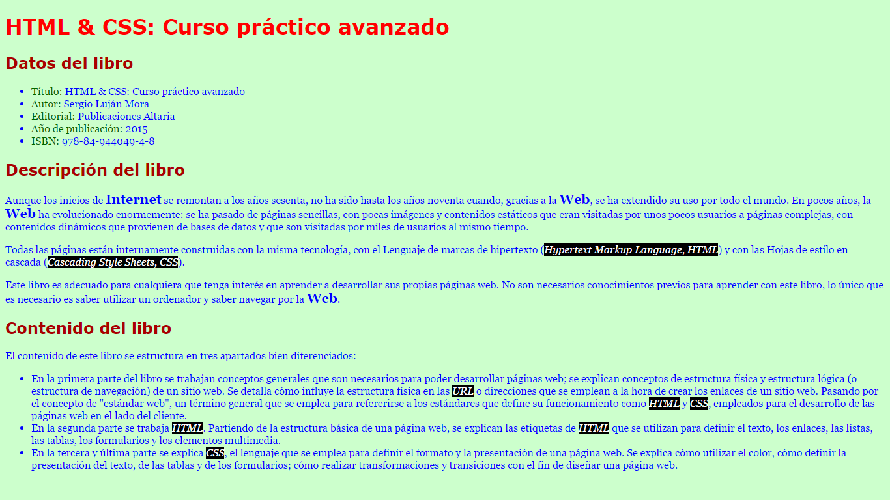

## Exercicios 

### Enunciado
> A partir de la página web que se te proporciona, debes emplear el atributo style para crear una página web que tenga el mismo aspecto que la siguiente imagen:
> 

Tienes que tener en cuenta los siguientes requisitos:

-   El texto principal:
    -   El color del texto es azul: #00F.
    -   El color de fondo del texto es verde claro: #CFC.
    -   El tipo de letra es la secuencia: Georgia, Cambria, serif.
    -   El tamaño del texto: 16px.
-   El encabezado de nivel 1:
    -   El color del texto es rojo claro: #F00.
    -   El tipo de letra es la secuencia: Verdana, Calibri, sans-serif.
    -   El tamaño del texto: 32px.
-   El encabezado de nivel 2:
    -   El color del texto es rojo claro: #A00.
    -   El tipo de letra es la secuencia: Verdana, Calibri, sans-serif.
    -   El tamaño del texto: 24px.
-   El color de los campos de los datos del libro es verde oscuro: #060.
-   El texto "Internet" y la "Web" cuando actúan como sustantivos:
    -   El tamaño del texto: 20px.
    -   Texto en negrita.
-   El texto "Hypertext Markup Language", "Cascading Style Sheets" y los acrónimos "HTML" y "CSS":
    -   El color del texto es blanco: #FFF.
    -   El color de fondo del texto es negro: #000.
    -   Texto en cursiva.

> Consejo: puedes utilizar las etiquetas de HTML ``em ``y ``strong``.
> 
> Consejo: puedes utilizar la etiqueta de HTML ``span`` para aplicar un estilo CSS a cualquier parte del texto.
>
## Selectores
### Enunciado
>A partir de la página web que se te proporciona, debes escribir las reglas CSS necesarias para lograr una página web que tenga el siguiente funcionamiento:

-   En su estado normal, un enlace se muestra de color rojo y sin subrayado (propiedad text-decoration).
-   Cuando el usuario sitúa el cursor del ratón sobre un enlace, se invierten los colores (el texto del enlace se muestra con color blanco sobre un fondo rojo) y se muestra el subrayado.
-   Cuando un enlace está activo, se muestra de color naranja y sin subrayado.
-   Cuando un enlace ha sido visitado, se muestra de color verde oscuro y sin subrayado.
-   Cuando un enlace tiene el foco del teclado, se muestra de color azul y se muestra el subrayado.

Consejo: el orden de escritura de las reglas influye en el resultado final, ya que un enlace puede estar en varios estados al mismo tiempo.